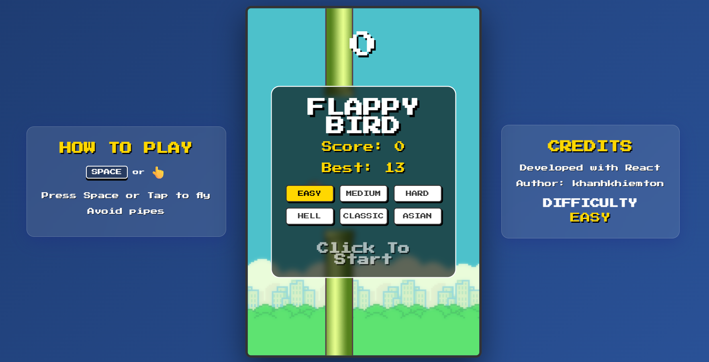

<p align="center">
  
</p>

<h1 align="center">🚀 FLAPPY BIRD REACTJS</h1>

<p align="center">
  
  
  
  
</p>

<p align="center">
  A lightweight, browser-based remake of the classic <b>Flappy Bird</b> game built with <b>React</b>, <b>Vite</b>, and <b>styled-components</b>.
</p>

<p align="center">
  <a href="#-key-features">Key Features</a> ·
  <a href="#-tech-stack">Tech Stack</a> ·
  <a href="#-project-structure">Project Structure</a> ·
  <a href="#-getting-started">Getting Started</a> ·
  <a href="#-how-to-play">How to Play</a> ·
  <a href="#-difficulty-levels">Difficulty Levels</a> ·
  <a href="#-available-scripts">Available Scripts</a> ·
  <a href="#-git-workflow">Git Workflow</a>
</p>

---

## 📸 Screenshots

<p align="center">
  
</p>

<p align="center">
  <em>Gameplay preview of Flappy Bird running on a web browser.</em>
</p>

---

## 📌 Key Features

- **Smooth Mechanics & Controls:** Enjoy responsive gameplay using keyboard keys (`Space` or `ArrowUp`), mouse clicks, or mobile screen taps.
- **Multiple Difficulty Levels:** Challenge yourself with 6 distinct difficulty modes (Easy, Medium, Hard, Hell, Classic, and Asian).
- **Responsive Web Design:** Built to auto-scale seamlessly across mobile, tablet, and desktop viewports.
- **Local High Score Saving:** Automatically tracks and saves your **Best Score** locally using browser `localStorage`.

---

## 🛠️ Tech Stack

- **Frontend:** React 18+ (Hooks, State Management)
- **Bundler & Build Tool:** Vite 5+ (Super-fast HMR and building)
- **Styling:** styled-components 5+ (CSS-in-JS for modular and dynamic UI styling)
- **Deployment-Ready:** Netlify-compatible configuration included.

---

## 📁 Project Structure

```text
├── FlappyBird/             # Main React application directory
│   ├── public/             # Static game assets (images, manifest...)
│   │   └── images/         # Game sprites and gameplay screenshots
│   └── src/                # React source code
│       ├── assets/         # Static development assets
│       ├── App.css         # Styling utilities
│       ├── App.jsx         # Gameplay, state management, and core UI logic
│       ├── index.css       # Global styles
│       └── main.jsx        # App entry point
├── .gitignore              # Git ignore configuration
└── README.md               # Main project documentation
```

---

## 💻 Getting Started

Follow these instructions to set up and run the project locally on your machine.

### Prerequisites

Ensure you have the following software installed:
- **Node.js** (v18.x or higher recommended)
- **npm** (included with Node.js) or another package manager (yarn / pnpm)

### Installation & Setup

1. **Clone the repository:**
   ```bash
   git clone https://github.com/VuKhanhNguyen/FlappyBird_ReactJS.git
   cd FlappyBird_ReactJS
   ```

2. **Install dependencies:**
   ```bash
   cd FlappyBird
   npm install
   ```

3. **Run the application:**
   Launch the development server:
   ```bash
   npm run dev
   ```
   Open your browser and navigate to `http://localhost:5173` (or the URL displayed in your terminal).

---

## 🎮 How to Play

### Objective
- Navigate the bird through the gaps between the green pipes without colliding.
- Each successful pass through a pair of pipes awards **+1 point**.

### Controls

| Action | Desktop Controls | Mobile / Touch Controls |
| :--- | :--- | :--- |
| **Flap (Fly Up)** | `Space` or `ArrowUp` or Mouse Click | Tap anywhere on the screen |
| **Start New Game** | First Flap Action | First Tap Action |

### Gameplay Tips
- Select your preferred difficulty level on the home screen before launching the game.
- Upon losing, the screen immediately displays your current score alongside your all-time **Best Score** (which automatically persists).

---

## 📊 Difficulty Levels

Game speed (pixels per second) and vertical pipe clearance (pixels) vary based on selected difficulty:

| Level | Speed (px/s) | Vertical Gap (px) | Description / Notes |
| :--- | :---: | :---: | :--- |
| **Easy** | 120 | 230 | Perfect for beginners learning the physics. |
| **Medium** | 150 | 200 | Balanced speed and spacing. |
| **Hard** | 180 | 180 | Fast-paced challenge for experienced players. |
| **Hell** | 230 | 140 | Extremely narrow gaps and high velocity. |
| **Classic** | 140 | 170 | Authentic feel with **dynamic speed** scaling up as you score higher. |
| **Asian** | 260 | 120 | The ultimate reflex test. Almost impossible. |

---

## ⚙️ Available Scripts

Run the following commands within the `/FlappyBird` directory:

| Command | Action / Purpose |
| :--- | :--- |
| `npm run dev` | Launches the local development server with HMR. |
| `npm run build` | Builds the optimized production bundle inside `dist/`. |
| `npm run preview` | Locally previews the built production application. |

---

## 🚀 Git Workflow

This project adheres to a clean branching and development workflow:

- **main / master**: Production-ready code only. Direct commits to main are prohibited.
- **develop**: Integration branch for new features and updates.
- **Branch Naming Conventions**:
  - Features: `feature/short-description`
  - Bug fixes: `bugfix/issue-description`
  - Hotfixes: `hotfix/critical-fix`

> [!TIP]
> Always pull the latest changes from the remote repository before creating a new branch or submitting a Pull Request (PR):
> `git checkout develop && git pull origin develop`

---

## 👥 Contributors

- **Vu Khanh Nguyen** - Lead Developer - [GitHub Profile](https://github.com/VuKhanhNguyen)

---

## 📄 License

This project is licensed under the MIT License - see the [LICENSE](LICENSE) file for details.
